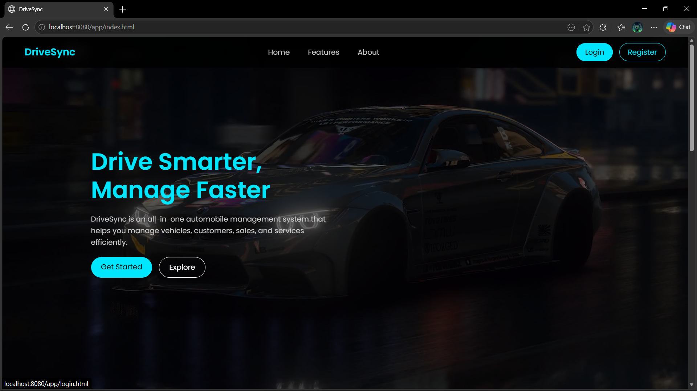
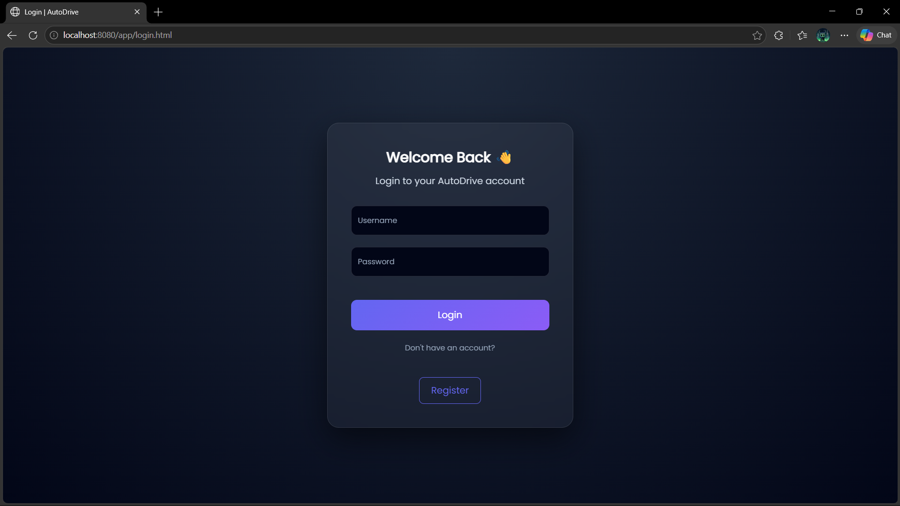
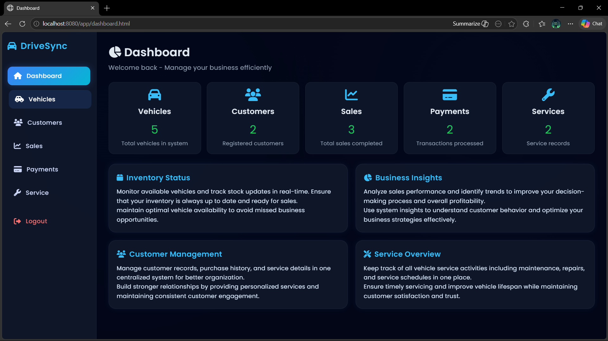
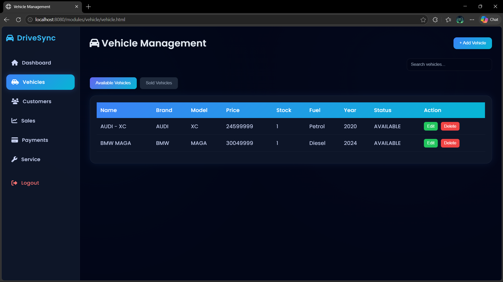
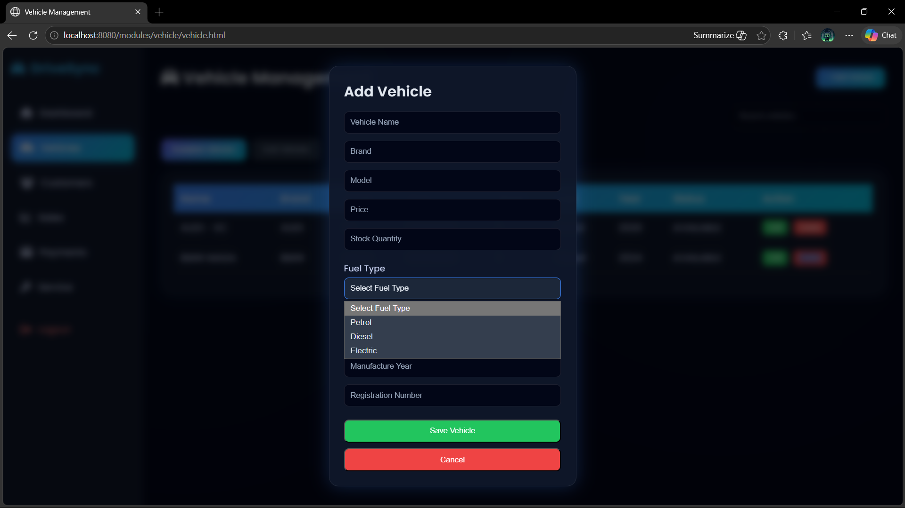
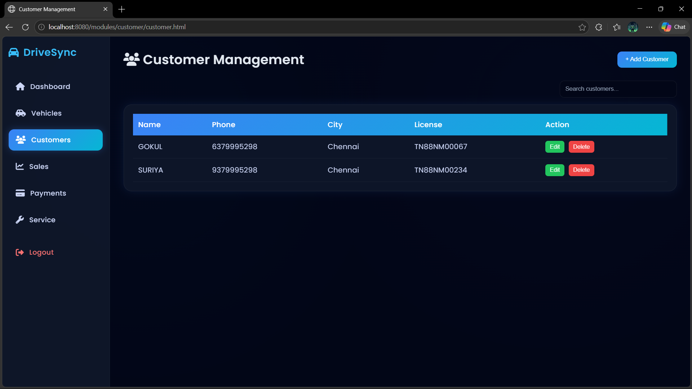
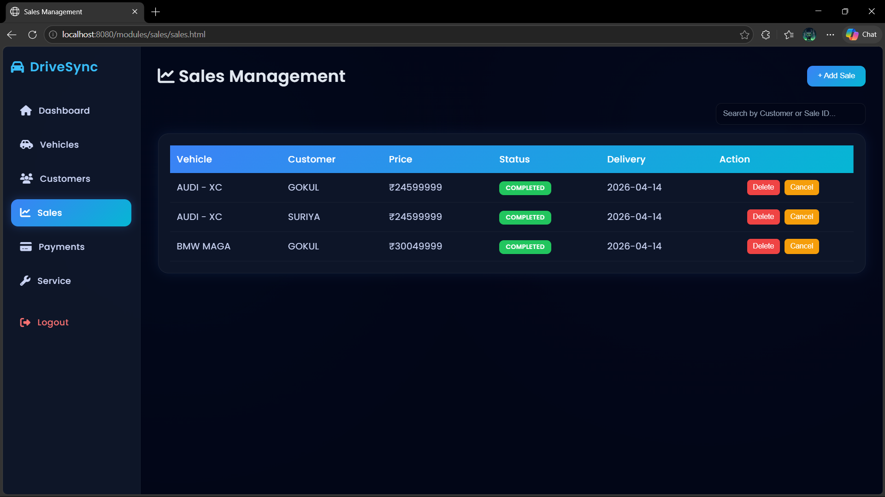
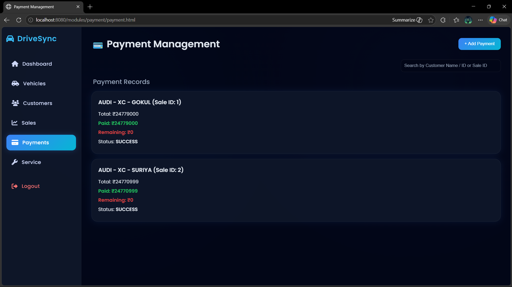
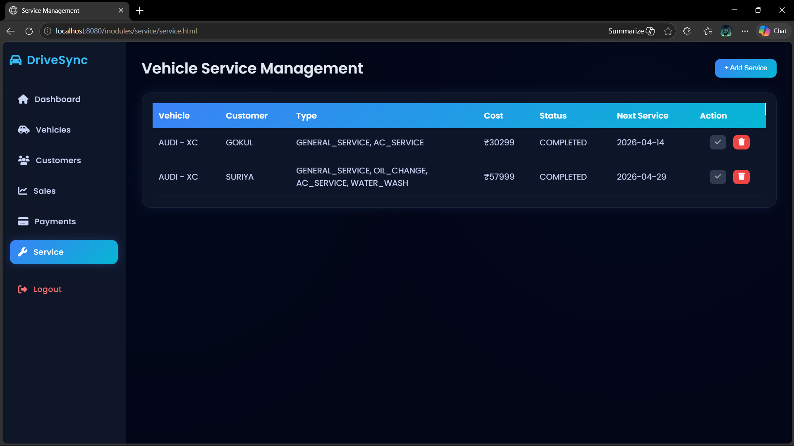
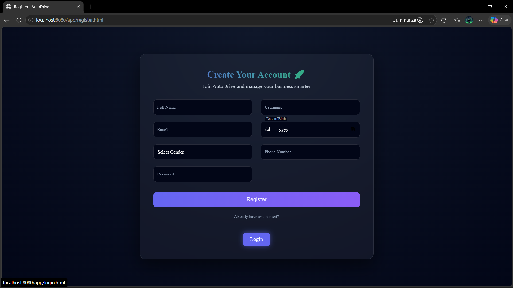

# 🚗 DriveSync — Automobile Service Management System


> A full-stack web application for managing automobile service operations — built with Java, Spring Boot, MySQL, and vanilla JavaScript.

---

## 📸 Screenshots

### 🏠 Home Page


### 🔐 Login Page


### 📊 Dashboard


### 🚘 Vehicle Management


### ➕ Add Vehicle


### 👥 Customer Management


### 💰 Sales


### 💳 Payment


### 🔧 Service Records


### 📝 Register


---

## 📌 About the Project

**DriveSync** is a complete full-stack web application designed to streamline vehicle service operations. It handles user management, vehicle tracking, sales, payments, and service workflows through a clean RESTful API backend and a responsive dark-themed frontend.

---

## ✨ Features

- 🔐 **Authentication** — Secure login and registration system
- 🚘 **Vehicle Management** — Add, edit, track vehicles with fuel type, stock, pricing
- 👥 **Customer Management** — Manage customer records and contact details
- 💰 **Sales Tracking** — Monitor and record sales transactions
- 💳 **Payment Management** — Track payment transactions
- 🔧 **Service Records** — Vehicle service history and maintenance tracking
- 📊 **Dashboard** — Real-time overview of vehicles, customers, sales, payments and services
- 📱 **Responsive UI** — Dark themed, modern interface

---

## 🛠️ Tech Stack

| Layer | Technology |
|-------|-----------|
| Language | Java (Core Java) |
| Backend Framework | Spring Boot |
| Frontend | HTML, CSS, JavaScript |
| Database | MySQL |
| Architecture | MVC + OOP Principles |
| Build Tool | Maven |
| Version Control | Git & GitHub |
| IDE | IntelliJ IDEA |

---

## 📁 Project Structure

```
AutomobileApplication/
├── src/
│   ├── main/
│   │   ├── java/
│   │   │   └── com/example/AutomobileApplication/
│   │   │       ├── controller/    # REST Controllers
│   │   │       ├── model/         # Entity Classes
│   │   │       ├── repository/    # Database Layer
│   │   │       ├── service/       # Business Logic
│   │   │       └── dto/           # Data Transfer Objects
│   │   └── resources/
│   │       ├── static/            # Frontend (HTML, CSS, JS)
│   │       └── application.properties
│   └── test/
├── screenshots/                   # Project Screenshots
├── pom.xml
└── README.md
```

---

## 🚀 Getting Started

### Prerequisites
- Java 17 or higher
- Maven
- MySQL
- IntelliJ IDEA (recommended)

### Installation

**1. Clone the repository:**
```bash
git clone https://github.com/gokulakrishnans016/automobile-service-management.git
cd automobile-service-management
```

**2. Set up the database:**
```sql
CREATE DATABASE automobile_db;
```

**3. Configure `application.properties`:**
```properties
spring.datasource.url=jdbc:mysql://localhost:3306/automobile_db
spring.datasource.username=your_username
spring.datasource.password=your_password
spring.jpa.hibernate.ddl-auto=update
```

**4. Run the application:**
```bash
mvn spring-boot:run
```

**5. Open in browser:**
```
http://localhost:8080
```

---

## 🔗 API Endpoints

| Method | Endpoint | Description |
|--------|----------|-------------|
| POST | `/api/auth/login` | User login |
| POST | `/api/auth/register` | User registration |
| GET | `/api/vehicles` | Get all vehicles |
| POST | `/api/vehicles` | Add a new vehicle |
| GET | `/api/customers` | Get all customers |
| POST | `/api/customers` | Add a new customer |
| GET | `/api/sales` | Get all sales |
| POST | `/api/sales` | Create a sale |
| GET | `/api/services` | Get all service records |
| POST | `/api/services` | Create a service record |
| GET | `/api/payments` | Get all payments |

---

## 💡 Key Learnings

- Designed and implemented **RESTful APIs** from scratch using Spring Boot
- Applied **MVC architecture** for clean, maintainable code
- Built a **responsive dark-themed frontend** integrated with backend APIs
- Managed relational data using **MySQL with JPA/Hibernate**
- Used **Maven** for dependency management and project build
- Implemented **authentication and authorization** for secure access

---

## 👨‍💻 Author

**Gokula Krishnan S**
- 📧 Email: [gokulakrishnan634@gmail.com](mailto:gokulakrishnan634@gmail.com)
- 💼 LinkedIn: [linkedin.com/in/gokulakrishnan-java](https://www.linkedin.com/in/gokulakrishnan-java)
- 🐙 GitHub: [github.com/gokulakrishnans016](https://github.com/gokulakrishnans016)

---

## 📄 License

This project is open source and available under the [MIT License](LICENSE).

---

<div align="center">
  ⭐ If you found this project useful, give it a star!
</div>
